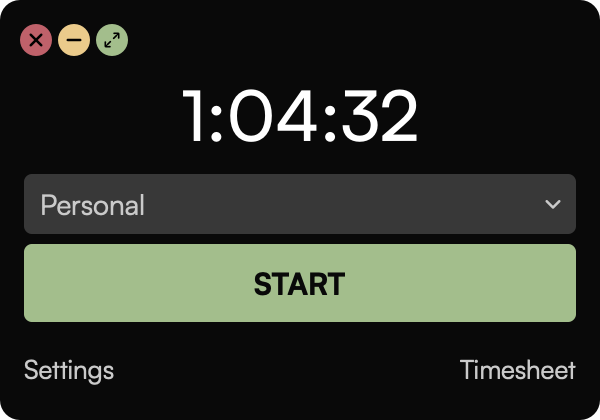
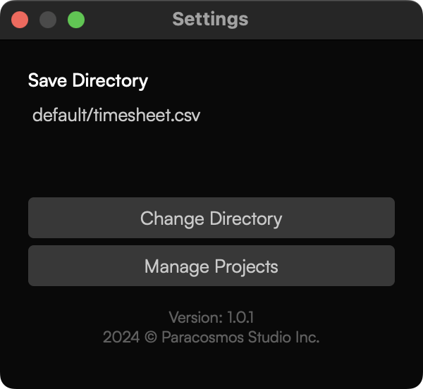
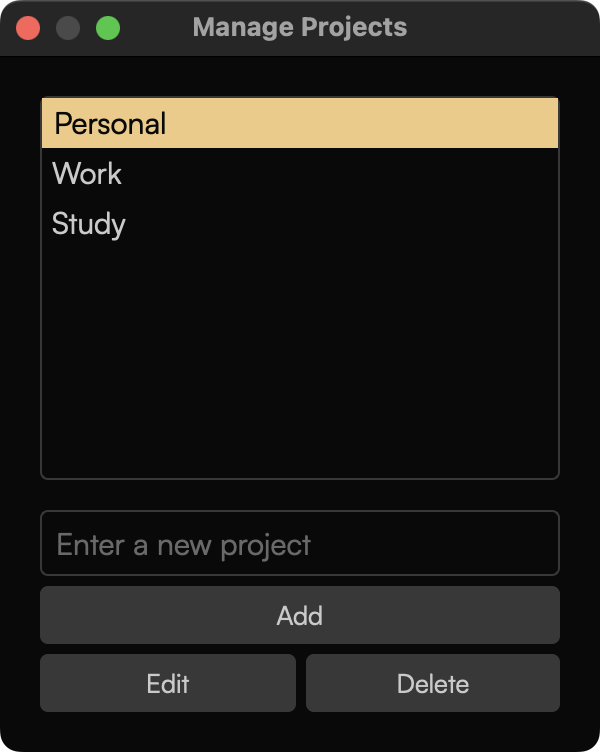

<center>
   
   <h3>Time Tracker</h3>
   <p>
      A desktop application that allows you to track time for multiple different projects. The data is stored locally in a <code>.csv</code> file. The location of the <code>.csv</code> file can be changed from the settings.
   </p>
</center>

## Screenshots

<center>
   
   
   
</center>

## Project Setup

1. Clone the repository and navigate to the project directory.
   ```bash
   git clone https://github.com/paracosmos-studio/time-tracker.git
   ```
   ```bash
   cd time-tracker
   ```
2. Create a virtual environment and activate it.
   ```bash
   python3 -m venv .venv
   ```
   ```bash
   source .venv/bin/activate   # For Linux and MacOS
   .venv\Scripts\activate      # For Windows
   ```

3. Install the required packages.
   ```bash
   pip3 install -r requirements.txt
   ```

4. Ignore changes to the `default` directory content.
   ```bash
   git update-index --assume-unchanged src/default/settings.json src/default/timesheet.csv
   ```

5. Run the application:
   ```bash
   python3 src/main.py
   ```


## Creating Executables

1. Install PyInstaller.
   ```bash
   pip3 install pyinstaller
   ```

2. Bundle the application.
   ```bash
   pyinstaller Timer.spec
   ```

It will create a `dist` directory with the executable files for your operating system.
